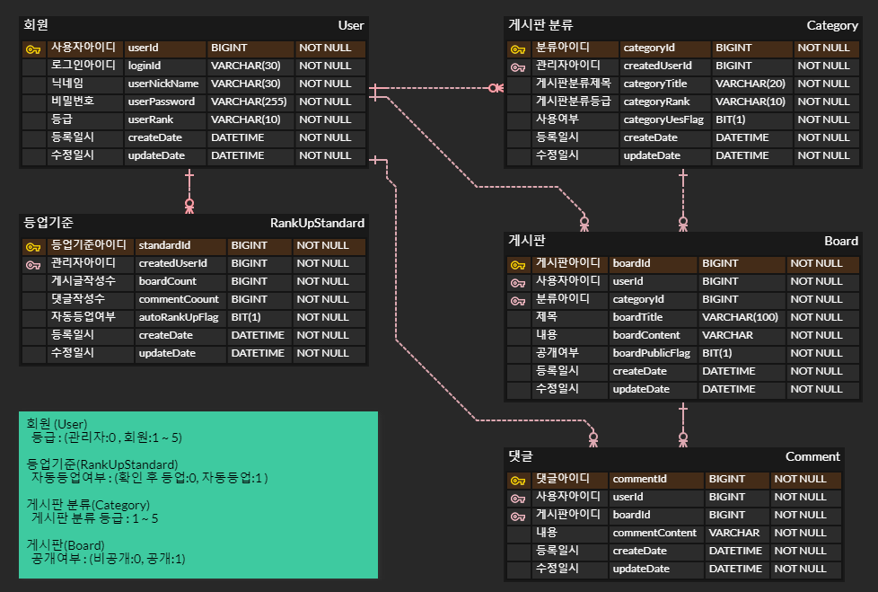

# :clipboard: 게시판
사용자간 소통할 수 있는 게시판

## 프로젝트 기간
* 2022.05.02 ~
   

## 프로젝트 기능
### 회원가입 :ballot_box_with_check:
* 회원가입을 진행할 수 있다.
* 아이디, 닉네임, 비밀번호를 입력 받는다.
* 회원 등급은 LEVEL1부터 LEVEL5까지 관리자 등급은 ADMIN 회원가입시 회원은 LEVEL1 관리자는 ADMIN 자동 등록 된다.

### 등업기준 :black_square_button:
* 각 등업 기준을 등록한다.
* 게시글, 댓글 등록 시 자동 등업 여부에 따라 자동으로 등업을 시키거나 관리자가 확인 후 등업 시킨다.

### 로그인 :ballot_box_with_check:
* 아이디, 비밀번호가 일치해야 한다.

### 게시판분류 조회 :black_square_button:
* 로그인 여부 없이 조회가 가능하다.

### 게시판분류 등록 :black_square_button:
* 관리자가 게시판 분류를 등록할 수 있다.

### 게시글 리스트 조회 :black_square_button:
* 로그인, 등급 여부 없이 조회가 가능하다. 단 비공개 글은 조회할 수 없다.
* 게시글은 최신순으로 조회되고, 제목, 닉네임으로 검색할 수 있고 비공개 글은 작성자와 로그인한 아이디가 일치 시 조회된다.

### 게시글 조회 :black_square_button:
* 로그인을 진행 후 등급에 맞는 글의 내용을 볼 수 있다.

### 게시글 작성 :black_square_button:
* 로그인을 진행해야 작성할 수 있다.
* 게시판 분류에 따라 등급이 나누어져 있어서 등급에 맞게 작성할 수 있다.
* 공개 여부를 선택할 수 있다. (공개:전체, 비공개:본인)

### 댓글 조회 :black_square_button:
* 로그인 여부 없이 조회가 가능하다.

### 댓글 작성 :black_square_button:
* 로그인을 진행해야 작성할 수 있다.

   

## 사용 기술스택
* Spring boot 2.7.11, Java jdk 11, Gradle
* MySql
* Spring Web, Spring Security, JPA, Lombok
* IntelliJ, MySql Workbench, erdcloud
   

## ERD

 

## 후기
*
