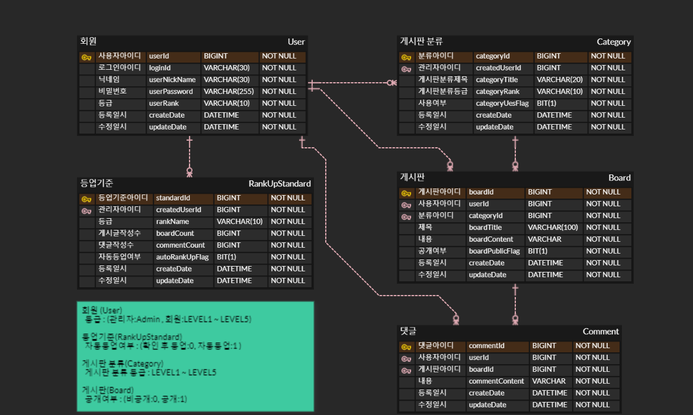

# :clipboard: 게시판
사용자간 소통할 수 있는 게시판

## 프로젝트 기간
* 2023.05.02 ~ 2023.06.05 (5주)
   

## 프로젝트 기능
### 회원가입 :ballot_box_with_check:
* 회원가입을 진행할 수 있다.
* 아이디, 닉네임, 비밀번호를 입력 받는다.
* 회원 등급은 LEVEL1부터 LEVEL5까지 관리자 등급은 ADMIN 회원가입시 회원은 LEVEL1 관리자는 ADMIN 자동 등록 된다.

### 로그인 :ballot_box_with_check:
* 로그인을 진행할 수 있다.
* 아이디, 비밀번호가 일치해야 한다.

### 등업기준 :ballot_box_with_check:
* 각 등업 기준을 등록한다.
* 게시글, 댓글 등록 시 자동 등업 여부에 따라 자동으로 등업을 시키거나 관리자가 확인 후 등업 시킨다.

### 게시판분류 :ballot_box_with_check:
* 게시판분류를 조회, 저장, 수정, 삭제를 진행할 수 있다.
* 로그인 여부 없이 조회가 가능하다.
* 게시판분류의 저장, 수정, 삭제는 관리자만이 진행할 수 있다.
* 게시판분류에 게시글이 있을 경우 수정, 삭제를 진행할 수 없다.

### 게시글 :ballot_box_with_check:
* 게시글을 조회, 저장, 수정, 삭제를 진행할 수 있다.
* 게시글은 목록은 최신순으로 제목, 닉네임으로 검색할 수 있고 비공개 글은 작성자와 로그인한 아이디가 일치 시 조회된다.
* 게시글의 목록은 기본 20개씩 보이지만 사용자의 선택에 따라 갯수를 변경하여 볼 수 있다.
* 사용자는 로그인을 진행 해야한다.
* 사용자는 각 등급에 맞는 게시판 분류에 글을 작성 및 조회할 수있다.
* 사용자가 같을 경우에만 수정, 삭제 가능하다.

### 댓글 :ballot_box_with_check:
* 댓글을 조회, 저장, 수정, 삭제를 진행할 수 있다.
* 게시글을 조회 해야 댓글을 볼 수있다.
* 게시글의 페이지는 기본 50개씩 볼 수 있다.

   

## 사용 기술스택
* Spring boot 2.7.11, Java jdk 11, Gradle
* MySql
* Spring Web, Spring Security, JPA, Lombok, JWT
* IntelliJ, MySql Workbench, erdcloud
   

## ERD

 

## 후기
* 등급 테이블을 따로 놨어야 했던거 같다. 처음 설계가 잘못 되어 고민이 많이 되었고 다시한번 처음 설계가 중요하다는걸 느끼게 되었다. 
  프로젝트는 재미 있었고, Uri 설계, Jpa의 projection 등 새로운걸 알게 되었다. 약 5주라는 시간동안 온전히 프로젝트에만 신경을 쓰진 못했지만 얼추 생각한대로 구현할 수 있어서 좋았다.
  부족한 부분은 공부를 진행하면서 채워나가면 될 것 같고, 시간이 된다면 설계를 수정하여 조금더 좋은 프로젝트로 바꾸고 싶다.
